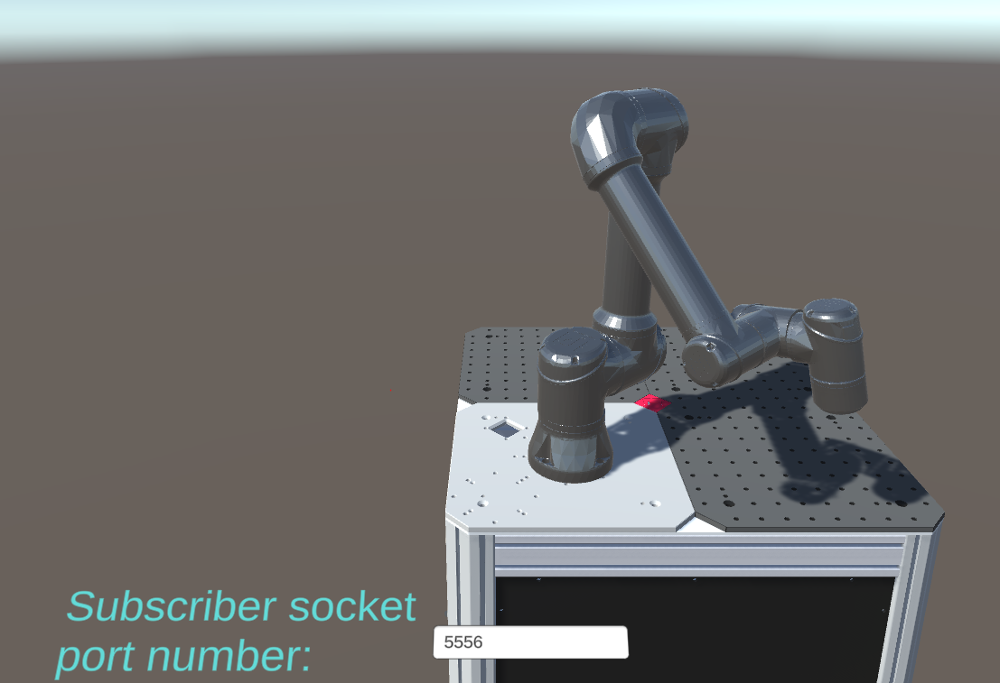

# Robot visualizer

This folder contains the code for the robot visualizer. The robot visualizer has the functionality of visualizing the robot movements in a 3D environment as well as to plot the trajectories of the robot.

The 3D visualization application is developed by Daniella Tola and is taken from the [URInterface repository](https://gitlab.au.dk/clagms/urinterface/-/tree/data_publisher?ref_type=heads)[^1]. 

The class ```robot_visualizer.py``` is developed to interface with this application and publish the robot data to the application.

[^1]: The application is actually a visualization for the Universal Robots UR5e robot, but it can be used for any robot with a similar kinematic structure and is therefore included in this repository.

## Contents
- [Robot visualizer](#robot-visualizer)
  - [Contents](#contents)
  - [Visualizing the robot in 3D](#visualizing-the-robot-in-3d)
  - [Plotting robot trajectories in 2D](#plotting-robot-trajectories-in-2d)

## Visualizing the robot in 3D
The robot visualizer is implemented using the ```RobotVisualizer``` class from the ```robot_visualizer.py``` file. The class is used to interface with the URInterface application and publish the robot data to the application in the following way:
1. Start the application using the ```start_application()``` method. This method starts the application and connects to the application using a socket connection. It is important that you manually input the port number when the application is started. The port number is vivid in the ```rm_config.py``` file and defaults to port 5556.

   



1. Publish joint positions: 
    1.  Publish a single joint position to the application using the ```publish_joint_positions(joint_position)``` method where ```joint_position``` is a numpy array of the 6 joint positions.
    2.  Visualize a full trajectory generated by the kinematic model using the ```visualize_trajectory(trajectory)``` method where ```trajectory``` is the ```q``` attribute of the ```Trajectory``` object returned by the kinematic model.
2. Stop the application using the ```stop_application()``` method.

## Plotting robot trajectories in 2D
The robot visualizer also has the functionality of plotting one or several robot trajectories in 2D. The ```plot_trajectory_2d()``` method is used to plot the robot trajectories in 2D. The method takes a list of trajectories as input and plots them in the same figure. It is also possible to input a list of labels to label the different trajectories. Also, the method takes a input ```joints``` which is a list of the joints to plot. The method is used in the following way:
```python
robot_visualizer.plot_trajectory_2d(trajectory=[trajectory1, trajectory2], 
                                    labels=['Trajectory 1', 'Trajectory 2'], 
                                    joints=[0, 1])
```
Which will plot the trajectories ```trajectory1``` and ```trajectory2``` in the same figure and label them with 'Trajectory 1' and 'Trajectory 2' respectively. The trajectories will be plotted for the joints 0 and 1.
