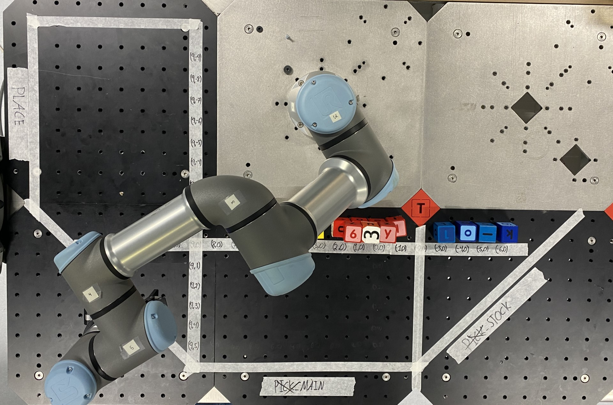

# Spatial model

This folder contains the code for the spatial model of the robot. The spatial model has the purpose of integrating spatial information relating to the environment. 

## Contents
- [Spatial model](#spatial-model)
  - [Contents](#contents)
  - [The grid](#the-grid)
  - [Conversion of grid positions into spatial poses](#conversion-of-grid-positions-into-spatial-poses)
  - [Using ```SpatialModel```](#using-spatialmodel)

## The grid
The *grid* is an abstraction of the plate around the robot. Specifically, the plate is divided into a number cells each determined by its column and row number. The grid is depicted below. Each grid position is denoted $P_G = (x_G, y_G) \in G$, where $G \subset \mathbb{Z}^{2}$ where the spacing between each grid point is $\delta_G$ (*hole distance*).



## Conversion of grid positions into spatial poses
The key functionality of the spatial model is to facilitate the transformation of each grid position $P_G$ into a spatial pose $S$. The translational component of $S$ is denoted $P_R = (x_R, y_R, z_R) \in W$ where $W\subset \mathbb{R}^3$ is the robot's workspace. The rotational component of $S$ is fixed, ensuring that the robot's third wrist remains perpendicular to the plate. This corresponds to a yaw-pitch-roll of $0$, $\pi$ and $0$, respectively.

The transformation from $P_G$ to $P_R$ is achieved by augmenting $P_G$ with a coordinate $z \in \mathbb{R}$ representing the height above the plate, resulting in the new coordinate $P_{G, A} = (P_G, z)$. Note that $z=0$ corresponds to the plate.  Subsequently, $P_{G, A}$ is mapped to $P_R$ using the hole distance $\delta_{H}$ and the offset $P_{R,0}$ measured at $P_{G} = (0, 0)$ using the approach:
$$
\begin{aligned}
    P_{R} = P_{R,0}+P_{G,A}\cdot\delta_H = (&(x_{R,0} + x_{G} \cdot \delta_H), \\
               &(y_{R,0} + y_{G} \cdot \delta_H),  \\ 
               &(z_{R,0} + z))
\end{aligned}
$$

## Using ```SpatialModel```
There is one public method ```compute_spatial_pose(x_G, y_G, table_distance=0., perform_safety_check=False)``` which is used to compute the spatial pose $S$ given the grid position $P_G = (x_G, y_G)$ and the height ```table_distance```. The method returns the spatial pose $S$ as a list of the form $[x_R, y_R, z_R, rx, ry, rz]$.

Aside from this, the model also performs a check when ```perform_safety_check``` is ```True``` to see whether the grid position is within the workspace of the robot (i.e. inside the white tape bands in the picture above). If the grid position is outside the workspace, a ```ValueError``` is raised. 

