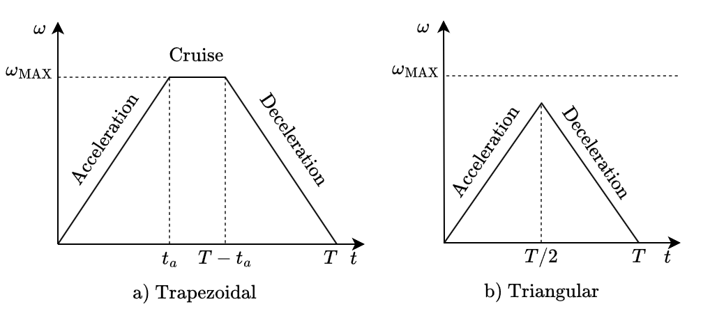

# Timing model
This folder contains the code for the timing model of the robot.

The timing model's purpose is to estimate the duration it takes for the robot to move between two different joint positions. 

## Contents
- [Timing model](#timing-model)
  - [Contents](#contents)
  - [Estimation method](#estimation-method)

## Estimation method
The estimation depends on the time scaling (the way the robot moves from one position to its target),  employed on the robot. We are using ```movej``` to control the robot, which results in a trapezoidal time scaling. This is controlled by three parameters: 
1. A target joint position $jp_t \in \mathbb{R}^6$
2. A maximum angular velocity $\omega_\text{MAX}$ 
3. An acceleration $\alpha$. 
 
If the movement is too short to reach maximum velocity, the time scaling will be triangular instead, as illustrated below:



The estimation of the duration corresponding to the movement between two joint positions $jp_1 \in \mathbb{R}^6$ and $jp_2\in \mathbb{R}^6$, can be split into three steps:
1) Calculate the distance $d_l$ traversed by the *leading axis* of the movement, which is the joint that has to traverse the longest distance. This is the only joint that is guranteed to have the specified movement parameters: $\omega_{\text{MAX}}$ and $\alpha$.
$$d_l = max(|jp_1-jp_2|)$$

1) Determine the time scaling of the movement. This is assumed to be either trapezoidal or triangular, as illustrated below.
$$\text{Time Scaling} = 
\begin{cases} 
    \text{Trapezoid}, & \text{if } d_l \geq  \omega_{\text{MAX}}^2/\alpha \\
    \text{Triangular} & \text{otherwise}
\end{cases}$$


3) Estimate the duration by summing the intervals of the movement. E.g. the duration of the trapezoidal move is equal to the sum of its time intervals (acceleration + cruise + deceleration). This is encapsulated in the formula: 


$$
\text{duration} = \begin{cases} 
      \displaystyle \frac{\alpha \max{(|jp_1 - jp_2|)} + \omega_{\text{MAX}}^2}{\alpha \omega_{\text{MAX}}} & \text{if Trapezoidal} \\
      \text{} & \\
      \displaystyle 2\sqrt{\frac{\max{(|jp_1 - jp_2|)}}{|\alpha|}} & \text{otherwise}
\end{cases}
$$

A lot of information were left out, but for a more in depth explanation on this check out section A.2.2 of the [BSc thesis](https://gitlab.au.dk/towards-digital-twin-aided-autonomy-for-a-robotic-manipulator/BSc-thesis).

